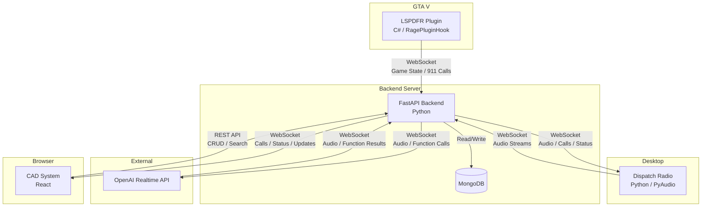

# Design Document: LSPDFR AI Dispatch

## Overview

The LSPDFR AI Dispatch system is a multi-component platform that delivers an immersive AI-powered police dispatch experience alongside the LSPDFR mod for GTA V. The system connects four components in real time:

1. **Dispatch Radio** — A Python desktop app providing continuous voice interaction via OpenAI Realtime API, with wake word detection, squelch effects, and 10-code protocol.
2. **LSPDFR Plugin** — A C# RagePluginHook plugin that reads live game state (peds, vehicles, location, wanted level) and generates 911 call events.
3. **CAD System** — A React web frontend for managing active calls, person/vehicle databases, citations, warrants, and BOLOs.
4. **Backend** — A FastAPI server acting as the central hub with WebSocket communication to all components, MongoDB persistence, and OpenAI Realtime API integration with function calling.

Data flows bidirectionally: the plugin pushes game state to the backend, the backend orchestrates AI responses and database operations, the dispatch radio handles voice I/O, and the CAD system provides visual management.

## Architecture

### High-Level Architecture Diagram



### Communication Patterns

- **Plugin → Backend**: WebSocket for game state updates (max 1/sec), 911 call events
- **Backend ↔ Dispatch Radio**: WebSocket for bidirectional audio streaming, call announcements, status acknowledgments
- **Backend ↔ OpenAI Realtime API**: WebSocket for audio forwarding and function calling
- **Backend → CAD**: WebSocket for real-time push (calls, status, BOLOs)
- **CAD → Backend**: REST API for CRUD operations (citations, warrants, searches)
- **Backend ↔ MongoDB**: Direct driver connection for all persistence

### Authentication

- WebSocket connections authenticated via shared API key in the initial handshake
- REST API endpoints secured with the same API key in request headers

## Components and Interfaces

### 1. Dispatch Radio (Python)

**Responsibilities:**
- Continuous microphone capture with wake word ("dispatch") detection
- Audio streaming to/from backend via WebSocket
- Squelch effect processing on dispatcher audio output
- Playback of AI dispatcher responses through configured output device

**Key Modules:**
- `AudioCapture` — Continuous mic input using PyAudio, wake word detection via keyword spotting
- `AudioPlayback` — Output device management, squelch effect pipeline (click-on → static → voice → click-off)
- `WebSocketClient` — Connection to backend, audio frame send/receive, reconnection logic (10s interval)
- `SessionManager` — Tracks active/passive listening state, silence timeout (configurable, default 2s)

**Interfaces:**
```
WS /ws/radio
  → send: { type: "audio_chunk", data: base64_pcm }
  → send: { type: "status_update", status: "listening" | "active" }
  ← recv: { type: "audio_response", data: base64_pcm }
  ← recv: { type: "call_announcement", call: CADCall }
  ← recv: { type: "status_ack", callsign: str, status: str }
```

### 2. LSPDFR Plugin (C#)

**Responsibilities:**
- Read nearby ped names, vehicle plates/models/colors from GTA V world
- Translate player coordinates to GTA V street names/landmarks
- Read wanted level of target peds
- Detect crime events and generate 911 call data
- Buffer updates when disconnected, rate-limit to 1 update/sec

**Key Classes:**
- `GameStateReader` — Polls GTA V APIs for peds, vehicles, player position
- `LocationResolver` — Converts coordinates to street names using GTA V native functions
- `CrimeEventDetector` — Monitors game events, generates 911 call payloads with caller descriptions
- `WebSocketTransport` — Connection to backend, buffering on disconnect, rate limiting

**Interfaces:**
```
WS /ws/plugin
  → send: { type: "game_state", data: GameState }
  → send: { type: "911_call", data: NineOneOneCall }
  ← recv: { type: "ack" }
```

### 3. CAD System (React)

**Responsibilities:**
- Display active calls board with priority color-coding
- Person and vehicle database search
- Citation and warrant CRUD forms
- Real-time updates via WebSocket

**Key Components:**
- `CallBoard` — Active calls table sorted by priority, color-coded (red/yellow/green), click for detail
- `PersonSearch` / `VehicleSearch` — Search forms with result display
- `CitationForm` / `WarrantForm` — Create/edit forms for enforcement records
- `WarrantList` — Filterable active warrants list with "mark served" action
- `WebSocketProvider` — React context for real-time updates

**Interfaces:**
```
WS /ws/cad
  ← recv: { type: "call_update", call: CADCall }
  ← recv: { type: "status_update", unit: str, status: str }
  ← recv: { type: "bolo_alert", bolo: BOLO }

REST Endpoints:
  GET    /api/calls                — List active calls
  GET    /api/calls/:id            — Get call details
  PUT    /api/calls/:id            — Update call notes/disposition
  GET    /api/persons?q=           — Search persons
  GET    /api/vehicles?q=          — Search vehicles
  POST   /api/citations            — Create citation
  GET    /api/warrants?active=true — List active warrants
  POST   /api/warrants             — Create warrant
  PUT    /api/warrants/:id/serve   — Mark warrant served
```

### 4. Backend (FastAPI)

**Responsibilities:**
- WebSocket hub for all component connections
- OpenAI Realtime API integration with function calling
- MongoDB CRUD for all collections
- Call generation from 911 events
- Real-time broadcast to connected clients

**Key Modules:**
- `WebSocketHub` — Manages connections for radio, plugin, CAD clients; handles routing and broadcast
- `OpenAIRealtimeClient` — WebSocket connection to OpenAI, audio forwarding, function call dispatch
- `FunctionRegistry` — Defines and executes function calling tools (plate_check, name_check, warrant_check, status_update, backup_request, bolo_create, call_assign)
- `CallManager` — Creates CAD calls from 911 events, manages call lifecycle
- `DatabaseService` — MongoDB operations for all collections, upsert logic, audit logging
- `SystemPromptBuilder` — Constructs the dispatcher system prompt with 10-codes, radio protocol, GTA V awareness

**Interfaces:**
```
WS /ws/radio     — Dispatch Radio connection
WS /ws/plugin    — LSPDFR Plugin connection  
WS /ws/cad       — CAD System connection
WS /ws/openai    — Internal: OpenAI Realtime API connection

REST /api/*       — CRUD endpoints for CAD System
```


## Data Models

### MongoDB Collections

#### `calls` — CAD Call Records
```json
{
  "_id": "ObjectId",
  "call_number": "string (auto-increment)",
  "type": "string (robbery, traffic_stop, domestic_disturbance, ...)",
  "priority": "int (1=high, 2=medium, 3=low)",
  "location": {
    "street": "string",
    "landmark": "string | null",
    "coordinates": { "x": "float", "y": "float", "z": "float" }
  },
  "description": "string",
  "suspect_description": "string | null",
  "assigned_units": ["string (callsigns)"],
  "status": "string (pending, dispatched, on_scene, closed)",
  "notes": ["{ text: string, timestamp: datetime, author: string }"],
  "disposition": "string | null",
  "created_at": "datetime",
  "updated_at": "datetime"
}
```

#### `persons` — Person / Ped Records
```json
{
  "_id": "ObjectId",
  "name": "string",
  "date_of_birth": "string (YYYY-MM-DD)",
  "physical_description": {
    "gender": "string",
    "race": "string",
    "height": "string",
    "weight": "string",
    "hair_color": "string",
    "distinguishing_marks": "string | null"
  },
  "prior_offenses": ["{ offense: string, date: string, disposition: string }"],
  "active_warrants": ["ObjectId (ref: warrants)"],
  "license_status": "string (valid, suspended, revoked, none)",
  "created_at": "datetime",
  "updated_at": "datetime"
}
```

#### `vehicles` — Vehicle Records
```json
{
  "_id": "ObjectId",
  "plate": "string",
  "make": "string",
  "model": "string",
  "color": "string",
  "registered_owner": "string (ref: persons.name)",
  "flags": ["string (stolen, bolo, expired_registration, ...)"],
  "created_at": "datetime",
  "updated_at": "datetime"
}
```

#### `citations` — Citation Records
```json
{
  "_id": "ObjectId",
  "person_name": "string",
  "person_id": "ObjectId (ref: persons)",
  "violation_type": "string",
  "location": "string",
  "date": "datetime",
  "officer_callsign": "string",
  "created_at": "datetime"
}
```

#### `warrants` — Warrant Records
```json
{
  "_id": "ObjectId",
  "person_name": "string",
  "person_id": "ObjectId (ref: persons)",
  "charge": "string",
  "issuing_authority": "string",
  "date_issued": "datetime",
  "status": "string (active, served)",
  "date_served": "datetime | null",
  "created_at": "datetime",
  "updated_at": "datetime"
}
```

#### `bolos` — BOLO Records
```json
{
  "_id": "ObjectId",
  "description": "string",
  "suspect_description": "string | null",
  "vehicle_description": "string | null",
  "issuing_officer": "string",
  "status": "string (active, cancelled)",
  "created_at": "datetime",
  "updated_at": "datetime"
}
```

#### `audit_log` — Database Write Audit
```json
{
  "_id": "ObjectId",
  "collection": "string",
  "operation": "string (insert, update, delete)",
  "document_id": "ObjectId",
  "timestamp": "datetime",
  "details": "object"
}
```

### Key Indexes

- `calls`: compound index on `(status, priority)` for active call board sorting
- `persons`: text index on `name`, index on `date_of_birth`
- `vehicles`: unique index on `plate`, text index on `(make, model)`
- `warrants`: compound index on `(status, person_name)`
- `citations`: index on `person_id`
- `audit_log`: index on `timestamp`

### WebSocket Message Types

```typescript
// Plugin → Backend
type GameStateMessage = {
  type: "game_state";
  data: {
    nearby_peds: Array<{ name: string; description: string; wanted_level: number }>;
    nearby_vehicles: Array<{ plate: string; make: string; model: string; color: string }>;
    officer_location: { street: string; landmark: string | null; x: number; y: number; z: number };
  };
};

type NineOneOneCallMessage = {
  type: "911_call";
  data: {
    crime_type: string;
    location: { street: string; landmark: string | null; x: number; y: number; z: number };
    involved_peds: Array<{ name: string; description: string }>;
    caller_description: string;
  };
};

// Backend → Radio
type AudioResponseMessage = { type: "audio_response"; data: string /* base64 PCM */ };
type CallAnnouncementMessage = { type: "call_announcement"; call: CADCall };
type StatusAckMessage = { type: "status_ack"; callsign: string; status: string };

// Backend → CAD
type CallUpdateMessage = { type: "call_update"; call: CADCall };
type UnitStatusMessage = { type: "status_update"; unit: string; status: string };
type BOLOAlertMessage = { type: "bolo_alert"; bolo: BOLO };
```

### Function Calling Definitions (OpenAI Realtime API)

The backend registers these tools with the OpenAI Realtime API:

| Function | Parameters | Returns |
|---|---|---|
| `plate_check` | `plate: string` | Vehicle record + owner info |
| `name_check` | `name: string` | Person record + priors + warrants |
| `warrant_check` | `name: string` | Active warrants for person |
| `update_officer_status` | `callsign: string, status_code: string` | Confirmation |
| `request_backup` | `location: string, details: string` | Created call ID |
| `create_bolo` | `description: string, suspect_desc?: string, vehicle_desc?: string` | Created BOLO ID |
| `assign_call` | `call_id: string, callsign: string` | Updated call |


## Correctness Properties

*A property is a characteristic or behavior that should hold true across all valid executions of a system — essentially, a formal statement about what the system should do. Properties serve as the bridge between human-readable specifications and machine-verifiable correctness guarantees.*

### Property 1: Wake word triggers state transition

*For any* audio input stream containing the wake word "dispatch", the Dispatch Radio session manager should transition from passive listening state to active command processing state.

**Validates: Requirements 1.2**

### Property 2: Silence timeout ends active session

*For any* active command processing session, when the audio input contains silence for the configured duration (default 2 seconds), the session manager should transition back to passive listening state.

**Validates: Requirements 1.4**

### Property 3: Squelch effect wraps audio

*For any* non-empty audio buffer passed through the squelch effect pipeline, the output should be longer than the input (due to prepended click-on and appended click-off frames) and the original audio content should be present within the output.

**Validates: Requirements 2.2**

### Property 4: System prompt contains required protocol elements

*For any* configuration (callsign, location context), the generated system prompt should contain references to 10-code protocol, radio brevity instructions, and GTA V location awareness directives.

**Validates: Requirements 2.3, 15.6**

### Property 5: Plate check returns complete vehicle record

*For any* vehicle record stored in the database, a plate check query for that vehicle's plate should return a response containing the vehicle's make, model, color, registered owner, and all associated flags.

**Validates: Requirements 3.1, 11.5**

### Property 6: Name check returns complete person record

*For any* person record stored in the database, a name check query should return the person's name, date of birth, physical description, prior offenses, active warrants, and license status.

**Validates: Requirements 3.2, 9.1, 9.4, 11.4**

### Property 7: Officer status update persistence

*For any* valid status 10-code (10-76, 10-97, 10-98, 10-8, 10-7) and any officer callsign, updating the officer's status should persist the new status in the database, and a subsequent query should return the updated status.

**Validates: Requirements 4.1**

### Property 8: Backend broadcasts events to all connected clients

*For any* backend event (call creation, status change, BOLO alert), all connected WebSocket clients (radio and CAD) should receive a corresponding update message.

**Validates: Requirements 4.3, 5.3**

### Property 9: Generated CAD calls contain all required fields

*For any* call generation input (crime type, location), the resulting CAD call should contain a non-empty call type, a location with street name, a suspect description, a valid priority level (1-3), and a status of "pending".

**Validates: Requirements 5.1, 10.1**

### Property 10: Call board sorting by priority

*For any* list of active CAD calls with varying priority levels, the call board should return them sorted by priority level in ascending order (priority 1 first, then 2, then 3).

**Validates: Requirements 5.5**

### Property 11: Call assignment updates both call and officer status

*For any* active CAD call and any officer callsign, assigning the officer to the call should add the callsign to the call's assigned_units list and set the officer's status to "10-76".

**Validates: Requirements 5.6**

### Property 12: Backup request creates high-priority call at location

*For any* officer location, a backup request should create a CAD call with priority 1 (high) and the location matching the officer's current position.

**Validates: Requirements 6.1**

### Property 13: BOLO creation persistence

*For any* BOLO description (with optional suspect and vehicle descriptions), creating a BOLO should persist a record in the database with status "active" and all provided description fields intact.

**Validates: Requirements 6.2**

### Property 14: Warrant check returns active warrants

*For any* person with active warrants in the database, a warrant check query should return all active warrants for that person. For any person with no active warrants, the query should return an empty result.

**Validates: Requirements 6.3**

### Property 15: Plugin message buffer on disconnect

*For any* sequence of game state updates generated while the WebSocket connection is down, all updates should be buffered locally and transmitted in order when the connection is restored, with no messages lost.

**Validates: Requirements 7.5**

### Property 16: Plugin rate limiting

*For any* sequence of rapid game state changes (multiple changes within one second), the plugin should emit at most one WebSocket message per second.

**Validates: Requirements 7.6**

### Property 17: 911 call event contains all required fields

*For any* crime event input (crime type, location, involved peds), the generated 911 call event should contain a non-empty crime type, a valid location, involved ped descriptions, and a non-empty caller description.

**Validates: Requirements 8.1, 8.4**

### Property 18: 911 event to CAD call conversion

*For any* 911 call event received by the backend, the resulting CAD call should have a priority level between 1 and 3, contain the crime type from the event, and include the location from the event.

**Validates: Requirements 8.3**

### Property 19: Criminal history generation completeness

*For any* new ped name and physical description with no existing record, the backend should generate a criminal history profile containing a date of birth, a license status from the valid set (valid, suspended, revoked, none), and a list of prior offenses (possibly empty).

**Validates: Requirements 9.3**

### Property 20: Criminal history persistence consistency (round trip)

*For any* ped, after a criminal history record is generated and stored, querying the same ped name should return an identical record. Repeated queries should always return the same data.

**Validates: Requirements 9.5**

### Property 21: Priority color-code mapping

*For any* priority level (1, 2, or 3), the color mapping function should return "red" for priority 1, "yellow" for priority 2, and "green" for priority 3.

**Validates: Requirements 10.3**

### Property 22: Call notes update round trip

*For any* CAD call and any note text, adding a note to the call and then retrieving the call should include the added note with a timestamp and author.

**Validates: Requirements 10.5**

### Property 23: Upsert idempotence for game state records

*For any* ped or vehicle data from the plugin, upserting the same data twice should result in exactly one record in the database, and the record should reflect the latest data.

**Validates: Requirements 11.6**

### Property 24: Citation creation links to person record

*For any* citation with a valid person name, creating the citation should persist it in the database and the person's record should be associated with the citation.

**Validates: Requirements 12.3**

### Property 25: Warrant creation flags person record

*For any* warrant with a valid person name, creating the warrant should persist it with status "active" and the person's record should include the warrant in their active_warrants list.

**Validates: Requirements 12.4**

### Property 26: Warrant filtering

*For any* set of warrants and a filter (by person name or charge type), the filtered results should contain only warrants matching the filter criteria, and no matching warrants should be excluded.

**Validates: Requirements 12.5**

### Property 27: Warrant served status update

*For any* active warrant, marking it as served should change its status to "served" and set a non-null date_served timestamp.

**Validates: Requirements 12.6**

### Property 28: WebSocket authentication rejects invalid keys

*For any* WebSocket connection attempt, if the provided API key does not match the configured shared key, the connection should be rejected. If the key matches, the connection should be accepted.

**Validates: Requirements 13.5**

### Property 29: CRUD round trip for all collections

*For any* valid entity (call, person, vehicle, citation, warrant, BOLO), creating it via the REST API and then reading it back should return an equivalent record with all fields preserved.

**Validates: Requirements 14.2**

### Property 30: Backend write queue on MongoDB failure

*For any* sequence of write operations issued while MongoDB is unavailable, all operations should be queued in memory and executed successfully when the connection is restored.

**Validates: Requirements 14.4**

### Property 31: Audit log for all writes

*For any* database write operation (insert, update, delete), an audit log entry should be created containing the collection name, operation type, document ID, and a timestamp.

**Validates: Requirements 14.5**

### Property 32: Function call dispatch executes correct operation

*For any* valid function call invocation (plate_check, name_check, warrant_check, update_officer_status, request_backup, create_bolo, assign_call) with valid parameters, the function dispatcher should execute the corresponding database operation and return a non-error result.

**Validates: Requirements 15.5**

### Property 33: Exponential backoff calculation

*For any* number of consecutive reconnection failures N (where N >= 0), the backoff delay should equal min(2^N, 60) seconds.

**Validates: Requirements 15.7**

### Property 34: Backend reconnection preserves pending updates

*For any* sequence of updates pending during a WebSocket client disconnection, all pending updates should be delivered when the client reconnects, with no data loss.

**Validates: Requirements 13.4**

## Error Handling

### Dispatch Radio Errors

| Error Condition | Handling Strategy |
|---|---|
| Microphone unavailable | Display error identifying missing device, retry every 5 seconds (Req 1.5) |
| OpenAI Realtime API connection failure | Play audible error tone, attempt reconnection every 10 seconds (Req 2.5) |
| No record found for plate/name check | Respond with "no record on file" using radio protocol (Req 3.4) |

### LSPDFR Plugin Errors

| Error Condition | Handling Strategy |
|---|---|
| WebSocket connection lost | Buffer game state updates locally, transmit on reconnection (Req 7.5) |
| Game API read failure | Log error, skip update cycle, retry on next tick |

### Backend Errors

| Error Condition | Handling Strategy |
|---|---|
| MongoDB connection failure | Queue writes in memory, retry connection every 5 seconds (Req 14.4) |
| MongoDB unavailable during lookup | Return error to caller, radio informs officer "system temporarily unavailable" (Req 3.5) |
| WebSocket client disconnect | Log disconnection, queue pending updates, accept reconnection (Req 13.4) |
| OpenAI Realtime API disconnect | Exponential backoff reconnection: 1s, 2s, 4s, ... up to 60s max (Req 15.7) |
| Invalid API key on WebSocket connect | Reject connection immediately (Req 13.5) |

### General Error Principles

- All errors are logged with timestamps and context
- Network errors trigger automatic retry with appropriate backoff
- Data operations during outages are queued, not dropped
- User-facing errors use radio protocol language for immersion

## Testing Strategy

### Unit Tests

Unit tests cover specific examples, edge cases, and error conditions:

- **Dispatch Radio**: Wake word detection with various audio samples, squelch effect output format, silence detection thresholds, microphone error handling
- **LSPDFR Plugin**: Game state message serialization, rate limiter edge cases (exactly 1 second boundary), buffer overflow handling, 911 call field validation
- **CAD System**: Component rendering with mock data, form validation (citation/warrant fields), priority color mapping, search result display
- **Backend**: API endpoint response codes, MongoDB connection error handling, WebSocket authentication rejection, function call parameter validation, audit log entry format, system prompt content verification, exponential backoff boundary values (0 failures = 1s, 6+ failures = 60s cap)

### Property-Based Tests

Property-based tests verify universal properties across randomly generated inputs. Each property test maps to a Correctness Property defined above.

**Library Selection:**
- Python (Backend, Dispatch Radio): [Hypothesis](https://hypothesis.readthedocs.io/)
- C# (LSPDFR Plugin): [FsCheck](https://fscheck.github.io/FsCheck/) via FsCheck.Xunit
- JavaScript/TypeScript (CAD System): [fast-check](https://fast-check.dev/)

**Configuration:**
- Minimum 100 iterations per property test
- Each test tagged with: `Feature: lspdfr-ai-dispatch, Property {number}: {property_text}`

**Property Test Mapping:**

| Property | Component | Test Description |
|---|---|---|
| 1 | Dispatch Radio | Generate audio streams with wake word at random positions, verify state transition |
| 2 | Dispatch Radio | Generate active sessions with varying silence durations, verify timeout behavior |
| 3 | Dispatch Radio | Generate random audio buffers, verify squelch output is longer and contains original |
| 4 | Backend | Generate random configs, verify system prompt contains required elements |
| 5 | Backend | Generate random vehicle records, insert and query by plate, verify all fields returned |
| 6 | Backend | Generate random person records, insert and query by name, verify all fields returned |
| 7 | Backend | Generate random valid 10-codes and callsigns, update and query, verify persistence |
| 8 | Backend | Generate events, create calls/status changes, verify all clients receive broadcasts |
| 9 | Backend | Generate random crime types and locations, verify CAD call completeness |
| 10 | Backend/CAD | Generate random call lists with varying priorities, verify sort order |
| 11 | Backend | Generate random call+officer pairs, assign, verify both records updated |
| 12 | Backend | Generate random locations, request backup, verify high-priority call created |
| 13 | Backend | Generate random BOLO descriptions, create, verify persistence |
| 14 | Backend | Generate persons with/without warrants, query, verify correct results |
| 15 | Plugin | Generate update sequences with simulated disconnects, verify all delivered on reconnect |
| 16 | Plugin | Generate rapid state changes, verify output rate ≤ 1/sec |
| 17 | Plugin | Generate random crime events, verify 911 call has all required fields |
| 18 | Backend | Generate random 911 events, verify CAD call has valid priority and matching details |
| 19 | Backend | Generate random ped names/descriptions, verify generated profile completeness |
| 20 | Backend | Generate peds, create profiles, query twice, verify identical results |
| 21 | CAD | Generate all priority values, verify color mapping correctness |
| 22 | Backend | Generate random calls and notes, add note, retrieve, verify note present |
| 23 | Backend | Generate random ped/vehicle data, upsert twice, verify single record with latest data |
| 24 | Backend | Generate random citations with person names, create, verify linkage |
| 25 | Backend | Generate random warrants with person names, create, verify person flagged |
| 26 | Backend | Generate random warrant sets and filters, verify filter correctness |
| 27 | Backend | Generate random active warrants, mark served, verify status and date |
| 28 | Backend | Generate random API keys (valid and invalid), verify accept/reject |
| 29 | Backend | Generate random entities for each collection, create then read, verify equivalence |
| 30 | Backend | Generate write sequences with simulated MongoDB failure, verify all queued and executed |
| 31 | Backend | Generate random write operations, verify audit log entries created |
| 32 | Backend | Generate random valid function calls, dispatch, verify correct operation executed |
| 33 | Backend | Generate random failure counts (0-100), verify backoff = min(2^N, 60) |
| 34 | Backend | Generate update sequences with simulated client disconnect, verify delivery on reconnect |

### Test Organization

```
tests/
├── dispatch_radio/
│   ├── test_wake_word.py          # Unit + Property (1, 2)
│   ├── test_squelch.py            # Unit + Property (3)
│   └── test_session.py            # Unit tests
├── plugin/
│   ├── TestRateLimiter.cs         # Unit + Property (16)
│   ├── TestMessageBuffer.cs       # Unit + Property (15)
│   └── TestCrimeEventDetector.cs  # Unit + Property (17)
├── backend/
│   ├── test_plate_check.py        # Unit + Property (5)
│   ├── test_name_check.py         # Unit + Property (6)
│   ├── test_officer_status.py     # Unit + Property (7)
│   ├── test_call_manager.py       # Unit + Property (9, 10, 11, 12, 18)
│   ├── test_bolo.py               # Unit + Property (13)
│   ├── test_warrants.py           # Unit + Property (14, 25, 26, 27)
│   ├── test_citations.py          # Unit + Property (24)
│   ├── test_criminal_history.py   # Unit + Property (19, 20)
│   ├── test_upsert.py             # Unit + Property (23)
│   ├── test_crud_roundtrip.py     # Property (29)
│   ├── test_websocket_hub.py      # Unit + Property (8, 28, 34)
│   ├── test_function_registry.py  # Unit + Property (32)
│   ├── test_system_prompt.py      # Unit + Property (4)
│   ├── test_backoff.py            # Unit + Property (33)
│   ├── test_audit_log.py          # Unit + Property (31)
│   └── test_write_queue.py        # Unit + Property (30)
└── cad/
    ├── CallBoard.test.tsx         # Unit + Property (10, 21)
    ├── PersonSearch.test.tsx      # Unit tests
    ├── VehicleSearch.test.tsx     # Unit tests
    ├── CitationForm.test.tsx      # Unit tests
    ├── WarrantForm.test.tsx       # Unit tests
    └── WarrantList.test.tsx       # Unit + Property (26)
```
